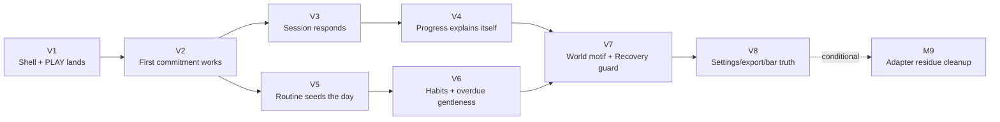

<!-- Source: ApexYard · templates/initiative.md · github.com/me2resh/apexyard · MIT -->

# Initiative: DailyXP Phase R — Redesign

**Status**: Active
**Scope**: per-project (`dailyxp`)
**Quarter / Timeframe**: Open-ended from 2026-08-24 — sequenced by DAG, not dates (deadline culture is what killed RELEASE-001)
**Owner**: MohamedKH
**Created**: 2026-08-24
**Last Updated**: 2026-08-24

---

## Goal

Rebuild DailyXP as a product Mohamed actually uses daily — a shape-first vertical-slice redesign where every merged PR leaves one real, working user moment in the live Omarchy plugin.

## Success criterion

Mohamed runs DailyXP daily from his own bar/panel for 14 consecutive days with every core-loop step (commitment → see → start → respond → survive) bound to the real engine — i.e. V8 merged and lived with, not merely demoed.

## Scope decision

This initiative is scoped as **per-project** (`dailyxp`). The redesign changes one product's surface and its engine bindings; no other registered project participates. Shaping artifacts live alongside it at `projects/dailyxp/shaping/{shaping-doc,slices}.md`; the phase boundary record is `projects/dailyxp/phase-r-declaration.md`.

---

## Dependency graph

Legend: filed = green; unfiled = yellow; cancelled = red dashed.

## Recommended sequence

Topologically sorted over the DAG above; ties broken by **value × risk-inverse**.

1. **V1 — Shell + PLAY lands** — no inbound deps; value H, risk M (sole stub-driven slice; R8 focus-chain verdict lands here)
2. **V2 — First commitment works** — depends on V1; value H, risk L-M (first real-engine bind: planning journal + persistence proof)
3. **V3 — Session responds** — depends on V2; value H, risk M (hardest behavior: restart-safe session replay)
4. **V5 — Routine seeds the day** — depends on V2; value M, risk L (parallel-ready with V3; low-risk occurrence generation)
5. **V4 — Progress explains itself** — depends on V3; value M, risk L (well-tested ProgressionModel)
6. **V6 — Habits + overdue gentleness** — depends on V5; value M, risk M (carryover edge cases feed the single-suggestion rule)
7. **V7 — World motif + Recovery guard** — depends on V4 + V6; value H, risk M (privacy guarantees must be provable at write sites)
8. **V8 — Settings/export/bar truth** — depends on V7; value M, risk L (hygiene tail; bar rebinding to live projections)
9. **M9 — Adapter residue cleanup** — depends on V8, **conditional**; value L, risk L (file only if fixture scaffolding leaves residue)

Sequence rationale: the spine is V1→V2→V3 because the core loop's first three steps are the product's reason to exist and each bind surfaces integration truth early. V5 branches off V2 (both consume planning) and sequences before V4 inside their layer purely on risk (occurrence generation is lower-risk than progression wiring, keeping momentum cheap between the two hard slices V3 and V7). V4 must precede V6→V7 because WORLD province cards read progression state. V8 is deliberately last-except-cleanup: nothing downstream depends on settings/export. M9 exists only if the V1 fixture adapter leaves dead scaffolding after V8.

---

## Milestones

### Milestone 1 — V1: Shell + PLAY lands

**Status**: filed
**Filing**: [Filed as #93](https://github.com/da5ater/dailyxp/issues/93)

- **Success criterion**: Demo verbatim — "Install plugin → panel opens to minimal PLAY with stub rail, tabs switch and keep state, Tab key walks every control with visible focus." Zero text overflow at real dimensions; harness PNG evidence.
- **Blocks**: V2
- **Blocked by**: none
- **Kill criterion**: If credible rendering fails after spike-informed attempts AND the visibility-toggle fallback also breaks focus traversal → return to shaping; do not ship an unusable shell.
- **Value**: High
- **Risk**: Medium
- **Confidence in time estimate**: Medium

The sole stub-driven exception (real-QML shell prototype): controller nav, ArcadeScreen/Card/Sheet/BevelButton/SegmentedBar primitives extracted, Theme.qml token bridge (spike-proven), PLAY landing rail + empty-state card. Fixture adapter (N10/N11) lives here and retires progressively from V2 on.

### Milestone 2 — V2: First commitment works

**Status**: filed
**Filing**: [Filed as #94](https://github.com/da5ater/dailyxp/issues/94)

- **Success criterion**: Demo verbatim — "Fresh install → 'Set your first commitment' → name+duration → Save → today-rail shows it from the real journal; kill shell, reopen — still there."
- **Blocks**: V3, V5
- **Blocked by**: V1
- **Kill criterion**: If the planning bind exposes engine gaps needing more than one follow-up fix PR, stop and reassess the engine assumption instead of forcing the slice.
- **Value**: High
- **Risk**: Low-Medium
- **Confidence in time estimate**: Medium

First real-engine bind: Commitment Sheet writes through `PlanningModel` → journal append → envelope save; rail reads `planningProjection`. Proves the close/reopen/reboot survival half of the core loop against `$XDG_STATE_HOME/dailyxp/`.

### Milestone 3 — V3: Session responds

**Status**: filed
**Filing**: [Filed as #95](https://github.com/da5ater/dailyxp/issues/95)

- **Success criterion**: Demo verbatim — "Press START → timer runs inline in rail → Pause/Resume → Finish → XP chip appears; kill shell mid-session, reopen — session resumes correctly."
- **Blocks**: V4
- **Blocked by**: V2
- **Kill criterion**: If restart-safe replay proves structurally unsound in `SessionModel`, escalate to `/investigation` — do not paper over replay bugs in UI code.
- **Value**: High
- **Risk**: Medium
- **Confidence in time estimate**: Medium

Binds `sessionCommand` IPC verbs → `SessionModel`/journal; inline timer reads live session runtime reconstructed from frozen timestamps. The "system responds" moment of the core loop.

### Milestone 4 — V5: Routine seeds the day

**Status**: filed
**Filing**: [Filed as #97](https://github.com/da5ater/dailyxp/issues/97)

- **Success criterion**: Demo verbatim — "SETUP → new routine 'Ruby 2h daily' → back to PLAY: today's occurrence card present, generated by the real planner."
- **Blocks**: V6
- **Blocked by**: V2
- **Kill criterion**: TBD
- **Value**: Medium
- **Risk**: Low
- **Confidence in time estimate**: High

Routine Sheet → real Routine → dated Occurrence generation through the planner journal. SETUP gets its first experiential payoff.

### Milestone 5 — V4: Progress explains itself

**Status**: filed
**Filing**: [Filed as #96](https://github.com/da5ater/dailyxp/issues/96)

- **Success criterion**: Demo verbatim — "Open JOURNEY → LV/rank/Momentum + segmented XP bar reflect V3's real earned XP; XP Ledger sheet lists those exact awards."
- **Blocks**: V7
- **Blocked by**: V3
- **Kill criterion**: TBD
- **Value**: Medium
- **Risk**: Low
- **Confidence in time estimate**: High

JOURNEY tiles/bar read `progressionProjection`; XP Ledger sheet renders genuine award rows with rule versions (R4.2 transparency made visible).

### Milestone 6 — V6: Habits + overdue gentleness

**Status**: filed
**Filing**: [Filed as #98](https://github.com/da5ater/dailyxp/issues/98)

- **Success criterion**: Demo verbatim — "Tap habit chip → completes for real; force an overdue occurrence → landing shows ONE small suggestion (start-smaller/reschedule/skip), never a list."
- **Blocks**: V7
- **Blocked by**: V5
- **Kill criterion**: If real carryover semantics make the single-gentle-suggestion rule impossible without engine surgery, reduce the strip to reschedule-only and file the richer behavior as its own feature — never ship the backlog dump.
- **Value**: Medium
- **Risk**: Medium
- **Confidence in time estimate**: Medium

Habit chips write real completions; the overdue micro-strip is driven by genuine carryover state with the R4.5 gentleness rule enforced structurally (N27 emits exactly one suggestion).

### Milestone 7 — V7: World motif + Recovery guard

**Status**: filed
**Filing**: [Filed as #99](https://github.com/da5ater/dailyxp/issues/99)

- **Success criterion**: Demo verbatim — "WORLD shows goal-as-province cards + Momentum banner; footer Recovery chip confirms first; check-in/relapse writes stay privacy-gated in the real journal."
- **Blocks**: V8
- **Blocked by**: V4, V6
- **Kill criterion**: If privacy gating cannot be enforced at the write sites without engine surgery, defer the entire Recovery UI portion until the engine fix lands — Recovery never ships ungated (R4.4 is absolute).
- **Value**: High
- **Risk**: Medium
- **Confidence in time estimate**: Medium

Light kingdom motif (R5.1): provinces mirror Goal progress via `StoryModel`; Momentum banner; Hollow King cause-lines only. Recovery Guard → Screen binds `RecoveryModel` with the private flag verified at every write site (R4.4).

### Milestone 8 — V8: Settings/export/bar truth

**Status**: filed
**Filing**: [Filed as #100](https://github.com/da5ater/dailyxp/issues/100)

- **Success criterion**: Demo verbatim — "SETUP edits persist across restart; Export JSON produces a valid file of real events; bar shows Lv / running elapsed from the live store."
- **Blocks**: M9 (conditionally)
- **Blocked by**: V7
- **Kill criterion**: If bar rebinding requires host-shell changes beyond the plugin API, descope to existing bar states and file the gap as a spike — do not fork the shell.
- **Value**: Medium
- **Risk**: Low
- **Confidence in time estimate**: High

Settings persistence, JSON export via existing EventModel canonical export, bar widget rebound to live projections (stub era fully ends).

### Milestone 9 — M9: Adapter residue cleanup (conditional)

**Status**: unfiled
**Filing**: unfiled — **file only if V1's fixture scaffolding leaves dead code after V8**

- **Success criterion**: No fixture adapter code remains in the tree; grep-clean of N10/N11 scaffolding; CI green. Non-user-facing by design.
- **Blocks**: none
- **Blocked by**: V8
- **Kill criterion**: Self-killing — if there is no residue, this milestone is cancelled without ceremony.
- **Value**: Low
- **Risk**: Low
- **Confidence in time estimate**: High

A `/task`, not a feature. Exists so the progressive-retirement promise ("nothing waits for a final swap") ends with a verifiably clean tree.

---

## Open uncertainties

Rolled up from per-milestone TBDs and known unknowns:

- **V2/V3 — time estimate confidence**: Medium across the board; estimation is downstream of filing (per skill rules), revisited at each `/start-ticket`.
- **V4, V5 — kill criteria**: TBD (deferred 2026-08-24) — both are low-risk well-tested binds; kill criteria matter more on V1/V3/V7 where they're specified.
- **V1 — focus traversal under Loader-mounted screens**: resolved by demo inside V1; visibility-toggle stacking is the pre-agreed fallback.
- **V3 — session replay across shell kill**: strongest model in the suite, but the kill-to-reopen path is the one behavior never exercised end-to-end before Phase R.

## Anti-scope

Things this initiative explicitly will NOT do:

- No Share Cards, Feed/sound, competition/cloud/social features (phase-r-declaration Out-of-scope list governs).
- No Season-XP competitive machinery obligations while competition is out.
- No accessibility beyond keyboard operability + visible focus + reduced motion; no localization.
- No engine rewrite during Phase R — binds are fix-forward; a wrong domain model triggers a respec of that domain, not a rewrite inside a slice.
- No features beyond the breadboard's affordances; new ideas go to `/idea`, not into slices mid-flight.
- No literal rendering of Stitch screens — Stitch is mood/token source; Shape A's breadboard is the structure.
- No bulk tracker operations; supersession happens via comments referencing #92 precedent.
- No deadline-driven merges; sequence pressure comes from the DAG only.

## Tracker orchestration plan

Repo `da5ater/dailyxp`. Label `phase-r` (created at filing time). Tickets `[Feature] V1…` / `[Task] M9`. Two-pass filing: pass 1 files topo-sorted with bodies carrying the vertical contract (**human action → real domain behavior → real persistence → visible evidence**) + demo statement + AC checkboxes + source footer pointing here; pass 2 splices `Blocks:`/`Blocked by:` cross-refs. Each slice ships as exactly one PR with deterministic harness evidence (qt6 offscreen+software), `.qml` diffs auto-gated to design review (ops `ui_paths`), Rex beside, CEO per-PR merge approval unchanged.

---

## Re-run history

Append-only. Each `/plan-initiative` re-run on this slug adds one entry.

| Date | Delta |
|------|-------|
| 2026-08-24 | Initial creation — 9 milestones (V1–V8 + conditional M9), scope=per-project. Milestones treated as FIXED per operator instruction (post-shaping approval); metadata derived from audit + spikes, not re-interviewed. |
| 2026-08-24 | Filed V1–V8 as da5ater/dailyxp#93–#100 (two-pass; cross-refs spliced). M9 left unfiled by design (self-killing conditional). Label `phase-r` created. |
