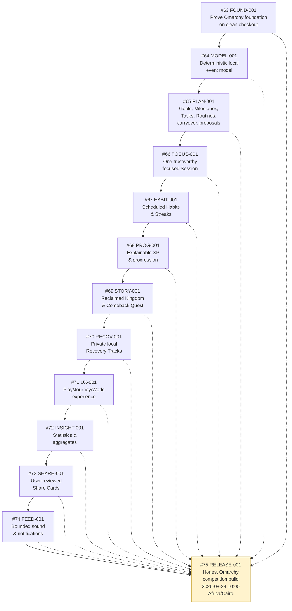

# Step C — Local stories DAG (FOUND-001 → RELEASE-001)

**Scope:** All issue numbers `#13`, `#59`–`#80` (Step B) and `#63`–`#75` (Step C) below are `da5ater/dailyxp` — not the ops fork. See `projects/dailyxp/step-c-dag.md` for the `blockedBy` wiring.

**Source:** PRD `docs/design/dailyxp-v1.md (Revised)` + `projects/dailyxp/gap-report.md § Ordered remediation backlog`
**Status:** Step B is 4/4 (`da5ater/dailyxp#59` `#60` `#62` `#61` via PRs `#77` `#78` `#79` `#80`). Step C executable stories #68–#71 are merged (`f39180b` `89bbdc7` `10e3c98` `1e7cea8` via PRs #86–#89) under the **executable bar** — see `projects/dailyxp/step-c-executable-triage.md` for the AC-by-AC verdicts. Remaining: #72 → #73 → #74 → #75, each one-PR-at-a-time in topological order; `RELEASE-001` lands last (deadline 2026-08-24 10:00 Africa/Cairo). Anti-scope per `vision.md` + `da5ater/dailyxp#13 [COLD]`: no cloud/League/AWS.



## Dependency table

| Issue | Story | blockedBy | Rationale (PRD `Depends on:`) |
|-------|-------|-----------|-------------------------------|
| #63 | FOUND-001 | *(none — Step B 4/4 green)* | Root of the local vertical slice |
| #64 | MODEL-001 | #63 | PRD MODEL `Depends on: FOUND-001` |
| #65 | PLAN-001 | #64 | PRD PLAN `Depends on: MODEL-001` |
| #66 | FOCUS-001 | #65 | PRD FOCUS `Depends on: PLAN-001` |
| #67 | HABIT-001 | #64 | PRD HABIT `Depends on: MODEL-001` (branches off MODEL, not FOCUS) |
| #68 | PROG-001 | #66, #67 | PRD PROG `Depends on: FOCUS-001, HABIT-001` — needs both |
| #69 | STORY-001 | #68 | PRD STORY `Depends on: PROG-001` |
| #70 | RECOV-001 | #68 | PRD RECOV `Depends on: PROG-001` (parallel to STORY) |
| #71 | UX-001 | #65, #66, #69, #70 | PRD UX `Depends on: PLAN, FOCUS, STORY, RECOV` + gap-report: UX must land **after** RECOV privacy |
| #72 | INSIGHT-001 | #71 | PRD INSIGHT `Depends on: UX-001` (Recovery isolation gate already proven in #62) |
| #73 | SHARE-001 | #72 | PRD SHARE `Depends on: INSIGHT-001` |
| #74 | FEED-001 | #66, #68, #71 | PRD FEED `Depends on: FOCUS, PROG, UX` |
| #75 | RELEASE-001 | #63, #64, #65, #66, #67, #68, #69, #70, #71, #72, #73, #74 | PRD RELEASE `Depends on:` FOUND … FEED (full local slice) — honest `0.x` cut |

Note on #67 vs gap-report order: the gap report lists HABIT after FOCUS for narrative convenience. The PRD has `HABIT-001 Depends on: MODEL-001`, so #67 can be **built and merged in parallel with #65/#66** (file-independent: `HabitModel` vs `PlanningModel`/`SessionModel`). The merge order in practice is still the numbered order above for simplicity — parallelism is an offer, not a requirement.

## Merge sequence (topological, one PR → one merge)

```
#63 → #64 → (#65 → #66) + #67 → #68 → (#69 + #70) → #71 → #72 → #73 → #74 → #75
          \__________________________/  \_________/  \________________________/
               parallel OK                parallel    blocked on #71
```

Every issue carries `Depends on: #N` in its body footer and a `blockedBy: #N` comment so the GitHub timeline shows the DAG without a native dependency field.

## What stays deferred

- `API-001 → V1-001` (16 placeholder cloud/league/social/AWS stories) remain `HOLLOW` per gap report — no repo, no code, no `blockedBy` wiring in this file.
- `da5ater/dailyxp#13 [COLD] 2026-10-20` re-audit stays OPEN and untouched; every Step C PR appends a no-change re-audit line there on merge per the PRD release discipline.

## Trace

- PRD: `docs/design/dailyxp-v1.md (Revised)` — User Stories § FOUND-001 … RELEASE-001
- Gap report: `projects/dailyxp/gap-report.md § Ordered remediation backlog + Story-by-story disposition + What we will NOT do`
- Step B evidence: `da5ater/dailyxp` PRs #77/#78/#79/#80 (see `projects/dailyxp/step-c-dag.md` + issue bodies)

