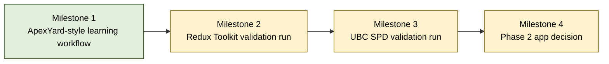

<!-- Source: ApexYard · templates/initiative.md · created via /plan-initiative -->

# Initiative: Self-Development Lifecycle

**Status**: Active
**Scope**: framework-wide
**Quarter / Timeframe**: roughly one full week of work
**Owner**: MohamedKH
**Created**: 2026-06-16
**Last Updated**: 2026-06-16

---

## Goal

Prove that an ApexYard-style, agent-first self-development lifecycle can turn selected learning sources, starting with Redux Toolkit and then UBC Systematic Program Design sections, into useful knowledge graphs, notes, artifacts, and test evidence before adding complementary features or building a GUI.

## Success criterion

The initiative is done when the workflow processes the Redux Toolkit source and at least one UBC Systematic Program Design section, and the resulting knowledge graph proves viable: it identifies meaningful prerequisites, detects missing nodes and misconceptions during the node loop, creates or revises the right nodes, and produces notes, artifacts, and test evidence useful enough for repeated personal use.

## Scope decision

This initiative is scoped as **framework-wide**. The work is currently a new product concept in `_inbox`, not a registered managed project. The first phase borrows ApexYard's operating model rather than targeting one existing codebase: agent-first workflow, markdown-first artifacts, lifecycle phases, gates, and reviewable evidence.

Per-project initiatives live at `projects/<name>/initiatives/<slug>.md`. Framework-wide initiatives live at `projects/initiatives/<slug>.md`.

---

## Dependency graph

Legend: filed = green; unfiled = yellow; cancelled = red dashed.

## Recommended sequence

Topologically sorted over the DAG above; ties broken by **value × risk-inverse**.

1. **ApexYard-style learning workflow** — no inbound deps; value High, risk Medium
2. **Redux Toolkit validation run** — depends on Milestone 1; value High, risk Medium
3. **UBC SPD validation run** — depends on Milestone 2; value High, risk Medium
4. **Phase 2 app decision** — depends on Milestone 3; value Medium, risk Medium

Sequence rationale: the workflow must exist before any source can validate it. Redux Toolkit runs first because it is concrete, code-heavy, and close to the user's current learning. UBC Systematic Program Design runs second to test whether the graph and artifact model generalizes beyond Redux/code-boilerplate concepts. The GUI/app decision is deliberately last; it should be made from evidence, not appetite.

---

## Milestones

### Milestone 1 — ApexYard-style learning workflow

**Status**: filed
**Filing**: Filed as [#2](https://github.com/da5ater/apexyard/issues/2)

- **Success criterion**: The feature can run one source through Intake, Graph Design, Branch Selection, Node Loop, Artifact Preservation, Final Test, and Review using local Markdown/HTML artifacts.
- **Blocks**: Redux Toolkit validation run
- **Blocked by**: none
- **Kill criterion**: Cancel or redesign if the lifecycle cannot preserve graph, node-loop, notes, artifacts, gates, and test evidence as durable files.
- **Value**: High
- **Risk**: Medium
- **Confidence in time estimate**: Medium

This milestone builds the Phase 1 learning framework: an agent-first skill/workflow inspired by ApexYard, with local session folders, graph files, notion-based notes, artifacts, gates, and review output. It is the buildable feature already filed as #2.

### Milestone 2 — Redux Toolkit validation run

**Status**: unfiled
**Filing**: unfiled

- **Success criterion**: The combined Redux Toolkit e-commerce Markdown source produces a viable graph, selected branch, live node loops, code-centered artifacts, final test score, and review summary that the user wants to use again.
- **Blocks**: UBC SPD validation run
- **Blocked by**: ApexYard-style learning workflow
- **Kill criterion**: Cancel or revise if the graph fails to identify meaningful Redux prerequisites, missing nodes, misconceptions, or useful code artifacts.
- **Value**: High
- **Risk**: Medium
- **Confidence in time estimate**: Medium

This milestone is the first real-world validation source. It tests whether the workflow works for current programming study material where code artifacts, API slice examples, and practical implementation details matter.

### Milestone 3 — UBC SPD validation run

**Status**: unfiled
**Filing**: unfiled

- **Success criterion**: At least one UBC Systematic Program Design section produces a viable graph, selected branch, explanatory artifacts, final test score, and review summary.
- **Blocks**: Phase 2 app decision
- **Blocked by**: Redux Toolkit validation run
- **Kill criterion**: Cancel or revise if the workflow only works for code-heavy Redux material and fails on more conceptual/systematic design material.
- **Value**: High
- **Risk**: Medium
- **Confidence in time estimate**: Medium

This milestone checks generality. It should reveal whether notion artifacts can handle more theoretical material, likely using diagrams and structured examples rather than only code snippets.

### Milestone 4 — Phase 2 app decision

**Status**: unfiled
**Filing**: unfiled

- **Success criterion**: Decide whether to build the GUI/app surface based on repeated personal value, stable artifact schemas, and clear interaction needs.
- **Blocks**: none
- **Blocked by**: UBC SPD validation run
- **Kill criterion**: Cancel or defer if the workflow is not yet repeatedly useful or if the artifact model is still unstable.
- **Value**: Medium
- **Risk**: Medium
- **Confidence in time estimate**: Medium

This milestone is not the GUI build. It is the decision gate for whether the product has earned a dedicated interface. If yes, a separate PRD/technical design should define the app surface over the same artifacts.

---

## Open uncertainties

- **Milestone 1 — LLM/provider and structured-output mechanism**: deferred to technical design.
- **Milestone 1 — deterministic replay harness**: deferred to technical design.
- **Milestone 1 — whether artifact diagrams default to Mermaid**: deferred to technical design.

---

## Anti-scope

Things this initiative explicitly will NOT do in Phase 1:

- Build a polished GUI or standalone app.
- Build native Anki sync.
- Add gamification, XP, levels, sharing, or achievements.
- Add video/audio ingestion, transcription, transcript parsing, or course-platform ingestion.
- Automate ingestion of reference systems, books, or creator content.
- Expand into all knowledge-worker use cases before the Redux Toolkit and UBC SPD validation runs.

---

## Re-run history

Append-only. Each `/plan-initiative` re-run on this slug adds one entry.

| Date | Delta |
|------|-------|
| 2026-06-16 | Initial creation — 4 milestones, scope=framework-wide |
